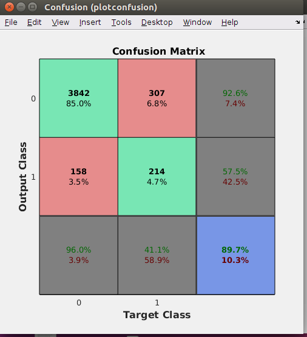
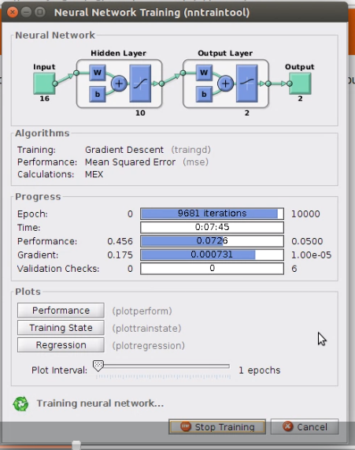
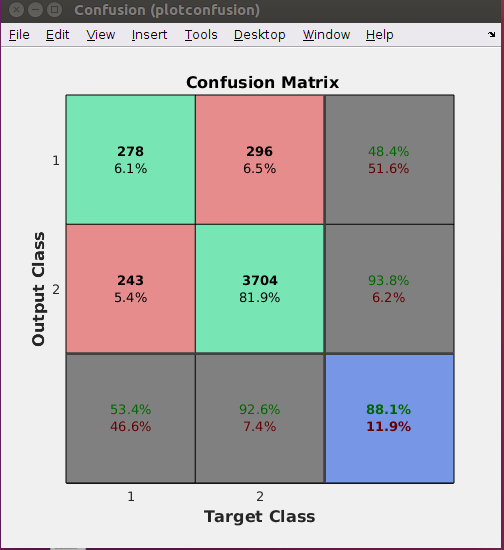

# ml_classifier

<strong>Project Overview:</strong>
This project is based on multivariate classification problem, where I am using Logistic Regression and Neural Network to train and test the accuracy. After training and testing I will compare both the algorithms (Logistic Regression and Neural Network ) with the help of confusion matrix.

<strong>Type of Data used:</strong>
The data is related with direct marketing campaigns of a Portuguese banking institution, which has columns like- 
age, job, marital, education etc.

There were few data's which were in ‘string’ like – job, marital, education (column) etc. and I transformed those strings into numeric (file name – importBankData.m) form for example - 
If job (column) status is ‘unemployed’ then numerical value would be 1
If job status is ‘services’ then numerical value would be 2 and so on.

I have used two types of data for my project-
Train Data (bank.scv)
Test Data (bank-full.csv)

The train data is a huge data which was used to train the algorithm, and the size of it is - [17 45212]
Test data is the one which was used to test both the algorithms for comparison, and the size of this data is – [17 4522].

<strong>Need for Logistic Regression:</strong>
Logistic regression is a statistical method for analyzing a dataset in which there are one or more independent variables that determine an outcome.
<ul><strong>Formulas Used:</strong>
	<li>h = logsig(theta*X);</li>
	<li>m = length(y);</li>
	<li>cost = -sum(y.*log(h)+(1-y).*(log(1-h)))/m;</li>
	<li>theta = theta -(alpha/m)*(h-y)*X';</li>
</ul>

<strong>Neural Network:</strong>
This is a computational approach which is based on a large collection of neural units loosely modeling the way a biological brain solves problems.
<ul><strong>Formulas Used:</strong>
	<li>net = newff(xNorm, yNT, 10, {'tansig' 'logsig'}, 'traingd', 'learngd','mse', {}, {}, '');</li>
	<li>net.trainParam.lr= 0.3; </li>
	<li>net.trainParam.goal = 0.05;</li>
	<li>net.trainParam.show = 100; </li>
	<li>net.trainParam.epochs = 10000; </li>
	<li>net = train(net, xNorm, yNT);</li>
</ul>

<strong>Conclusion:</strong>
I have added the picture of confusion matrix for both the models below. 1st is the result of Logistic Regression Confusion Matrix and 2nd one is Neural Network Confusion Matrix.

Logistic Regression:

Neural Network:

The accuracy rate of Logistic Regression is 89.7% whereas, Neural Network has 88.1% of accuracy. Hence, by seeing the outcome of both the algorithm I can say for this case Logistic Regression was more accurate then Neural Network.

<strong>Please find the full demo on the link below:</strong>

<a href="https://www.youtube.com/watch?v=UBNtiXGJGao&feature=youtu.be">Part #1</a>
<a href="https://www.youtube.com/watch?v=LSKmiJJSKmw&feature=youtu.be">Part #2</a>

